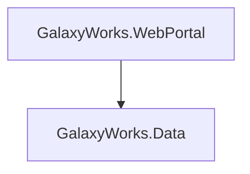

# Initiative 6 Phase 4: Markdown Output Format — Implementation Plan

## Context

Scatter currently outputs to console, CSV, and JSON. None of these serve the most common sharing
workflow: **paste into a PR, ticket, or wiki**. Console output loses formatting when pasted.
JSON is for machines. CSV is for spreadsheets.

Markdown is the universal interchange format for technical communication. GitHub renders it, ADO
renders it, Confluence renders it, Slack renders it (partially). A single `--output-format markdown`
addition makes Scatter output immediately shareable without manual reformatting.

Ref: docs/OUTPUT_REPORT_EVALUATION.md, Section E (lines 413-437).

---

## Step 1: Create `scatter/reports/markdown_reporter.py`

New file with three builder functions (return `str`), three thin write wrappers (write to file),
and shared helpers. This separation mirrors `build_graph_json()` / `write_graph_json_report()`
and enables reuse for Initiative 7 PR comments (post markdown without writing a temp file).

### 1a. Shared helpers

```python
def _escape_cell(value: str) -> str:
```

Sanitize a value for use inside a markdown table cell:
- Replace `|` with `\|`
- Replace `\n` with a space
- Strip leading/trailing whitespace

Applied to every table cell value across all three modes.

```python
def _fmt_metadata(metadata: Dict) -> str:
```

Returns a small italic footer line:

```markdown
*Generated by Scatter v0.2.0 at 2026-03-13T14:30:00Z*
```

Uses `metadata['scatter_version']` and `metadata['timestamp']`. Returns empty string if `metadata is None`.

```python
def _fmt_pipeline(pipeline: FilterPipeline) -> str:
```

Returns a markdown blockquote with search scope and filter arrow chain. Inlines
`pipeline.format_arrow_chain()` (already implemented) with markdown bold formatting.
Returns empty string if `pipeline is None`.

```markdown
> **Search scope:** `/path/to/repo` (scanned 200 projects, 1,847 files)
> **Filter:** 200 → 12 project refs → 8 namespace → 4 class match
```

```python
def _write_file(content: str, output_file_path: Path) -> None:
```

Shared file-write helper used by all three `write_*` functions. Creates parent dirs and
writes UTF-8 content. Single place for I/O error handling and logging.

### 1b. `build_markdown()` + `write_markdown_report()` — legacy modes (git/target/sproc)

**Signatures:**
```python
def build_markdown(
    detailed_results: List[Dict],
    metadata: Optional[Dict] = None,
    pipeline: Optional[FilterPipeline] = None,
) -> str:

def write_markdown_report(
    detailed_results: List[Dict],
    output_file_path: Path,
    metadata: Optional[Dict] = None,
    pipeline: Optional[FilterPipeline] = None,
) -> None:
```

`write_markdown_report` calls `build_markdown` then `_write_file`. Thin wrapper only.

**Output structure:**
```markdown
# Consumer Analysis Report

> **Search scope:** . (scanned 200 projects, 1,847 files)
> **Filter:** 200 → 12 project refs → 8 namespace → 4 class match

## GalaxyWorks.Data

Type/Level: PortalDataService

| Consumer | Path | Pipeline | Solutions |
|----------|------|----------|-----------|
| GalaxyWorks.WebPortal | src/WebPortal/WebPortal.csproj | portal-pipeline | Portal.sln |
| MyGalaxyConsumerApp | src/Consumer/Consumer.csproj | — | — |

## AnotherTarget.Project

...

---
**Total:** 4 consuming relationship(s) across 2 target(s).

*Generated by Scatter v0.2.0 at 2026-03-13T14:30:00Z*
```

**Logic:**
- Group `detailed_results` by `(TargetProjectName, TriggeringType)` — same grouping as `print_console_report()`
- For each group: H2 header with target name + path, optional type/level line (omit if "N/A"), markdown table with consumers
- Pipeline column: show pipeline name or "—" if absent
- Solutions column: join with ", " or "—" if empty
- All cell values passed through `_escape_cell()`
- Omit BatchJobVerification and ConsumerFileSummaries from the table (too verbose for markdown; they're available in JSON)
- Footer: total count + metadata

### 1c. `build_impact_markdown()` + `write_impact_markdown_report()` — impact mode

**Signatures:**
```python
def build_impact_markdown(
    report: ImpactReport,
    metadata: Optional[Dict] = None,
) -> str:

def write_impact_markdown_report(
    report: ImpactReport,
    output_file_path: Path,
    metadata: Optional[Dict] = None,
) -> None:
```

**Output structure:**
```markdown
# Impact Analysis

**Work Request:** Modify PortalDataService to add retry logic...

**Overall Risk:** High | **Complexity:** Medium (3-5 developer-days)

## GalaxyWorks.Data

Direct Consumers: 3 | Transitive: 1

### Blast Radius

```text
├── GalaxyWorks.WebPortal  [HIGH]  direct
│   Risk: Medium — "Uses PortalDataService directly"
│   Pipeline: portal-pipeline
│   Solutions: Portal.sln
│   └── GalaxyWorks.BatchProcessor  [MEDIUM]  via WebPortal
├── MyGalaxyConsumerApp         [MEDIUM] direct
└── MyGalaxyConsumerApp2        [LOW]    direct
```

### Consumer Detail

| Consumer | Confidence | Depth | Via | Risk | Pipeline | Solutions |
|----------|------------|-------|-----|------|----------|-----------|
| GalaxyWorks.WebPortal | HIGH | direct | — | Medium | portal-pipeline | Portal.sln |
| GalaxyWorks.BatchProcessor | MEDIUM | 1 | WebPortal | Low | batch-pipeline | — |
| MyGalaxyConsumerApp | MEDIUM | direct | — | — | consumer-pipeline | — |
| MyGalaxyConsumerApp2 | LOW | direct | — | — | — | — |

### Complexity

Medium: Multiple consumers with one transitive chain...

### Impact Summary

This change affects a core data access service used by 4 consumers...

---

*Generated by Scatter v0.2.0 at 2026-03-13T14:30:00Z*
```

**Logic:**
- H1 with report title
- Work request: truncated to 200 chars (same as console)
- Risk/complexity summary line with effort estimate if present
- For each `TargetImpact`: H2 with target name, direct/transitive counts
- **Blast Radius section (H3):** Reuse `_render_tree()` from `console_reporter.py` inside a
  fenced code block (````text`). This preserves the Phase 3 tree hierarchy — box-drawing
  characters render correctly in code blocks. Shows risk, pipeline, solutions, coupling
  narrative, and coupling vectors per consumer (same as console).
- **Consumer Detail section (H3):** Flat markdown table for easy scanning and sorting.
  Columns: Consumer, Confidence, Depth, Via, Risk, Pipeline, Solutions.
  Depth column: "direct" for depth 0, numeric for depth > 0.
  Via column: `propagation_parent` or "—".
  Risk column: `risk_rating` or "—".
  Pipeline column: `pipeline_name` or "—".
  Solutions column: join with ", " or "—".
  All cell values through `_escape_cell()`.
- After the per-target sections: complexity section (H3) and impact narrative section (H3), only if present
- Footer: metadata

This dual rendering (tree + table) gives the best of both: the tree shows propagation paths
at a glance, the table is sortable/greppable and works for consumers who paste into spreadsheets.

### 1d. `build_graph_markdown()` + `write_graph_markdown_report()` — graph mode

**Signatures:**
```python
def build_graph_markdown(
    graph: DependencyGraph,
    metrics: Dict[str, ProjectMetrics],
    ranked: List[Tuple[str, ProjectMetrics]],
    cycles: List[CycleGroup],
    clusters: Optional[List] = None,
    metadata: Optional[Dict] = None,
    dashboard=None,
) -> str:

def write_graph_markdown_report(
    graph: DependencyGraph,
    metrics: Dict[str, ProjectMetrics],
    ranked: List[Tuple[str, ProjectMetrics]],
    cycles: List[CycleGroup],
    output_file_path: Path,
    clusters: Optional[List] = None,
    metadata: Optional[Dict] = None,
    dashboard=None,
) -> None:
```

**Output structure:**
```markdown
# Dependency Graph Analysis

| Metric | Value |
|--------|-------|
| Projects | 108 |
| Dependencies | 247 |
| Connected components | 3 |
| Circular dependencies | 2 |

## Top Coupled Projects

| Project | Score | Fan-In | Fan-Out | Instability |
|---------|-------|--------|---------|-------------|
| GalaxyWorks.Data | 12.3 | 8 | 4 | 0.33 |
| GalaxyWorks.WebPortal | 9.1 | 5 | 6 | 0.55 |

## Circular Dependencies

1. **[3 projects]** A → B → C → A
2. **[2 projects]** D → E → D

## Domain Clusters

| Cluster | Size | Cohesion | Coupling | Feasibility |
|---------|------|----------|----------|-------------|
| GalaxyWorks | 5 | 0.800 | 0.200 | easy (0.850) |
| Consumer | 3 | 0.600 | 0.400 | moderate (0.550) |

## Observations

- **[warning]** GalaxyWorks.Data has high coupling (score: 12.3)
- **[info]** GalaxyWorks.Core is a stable core dependency (instability: 0.05)

## Dependency Diagram



---

*Generated by Scatter v0.2.0 at 2026-03-13T14:30:00Z*
```

**Logic:**
- H1 title
- Summary stats as a small 2-column table
- Top coupled projects: reuse `ranked` list, same columns as console. All cell values through `_escape_cell()`.
- Cycles: numbered list with bold project count + arrow chain
- Domain clusters: table with name, size, cohesion, coupling, feasibility
- Observations: from `dashboard.observations` — bulleted list with severity in bold
- Dependency diagram: call existing `generate_mermaid(graph, clusters=clusters, top_n=20)` from graph_reporter.py, wrapped in a ````mermaid` fenced code block. Cap at `top_n=20` to keep the diagram readable.
- Footer: metadata

All sections are conditional — omit if data is empty (e.g., no cycles → skip cycles section).

---

## Step 2: Wire `--output-format markdown` into `__main__.py`

### 2a. Add "markdown" to choices

**File:** `scatter/__main__.py` line 202

```python
# Before:
choices=['console', 'csv', 'json'],
# After:
choices=['console', 'csv', 'json', 'markdown'],
```

Update help text:
```python
help="Format for the output. 'console' prints to screen. 'csv', 'json', or 'markdown' writes to --output-file (markdown also prints to stdout if no file given)."
```

### 2b. Extract `_require_output_file` helper

Add a helper to eliminate the repeated validation pattern (currently 6 instances, would be 9 with markdown):

```python
def _require_output_file(args, format_name: str) -> Path:
    """Validate --output-file is provided for file-based formats. Exit if missing."""
    if not args.output_file:
        logging.error(f"{format_name} output format requires the --output-file argument.")
        sys.exit(1)
    return Path(args.output_file)
```

Replace all existing `if not args.output_file: ... sys.exit(1)` blocks with `output_path = _require_output_file(args, "JSON")` (etc.). This cleans up ~18 lines of duplicated validation across existing JSON/CSV dispatch sites.

### 2c. Add imports

Add lazy imports within each mode's dispatch block (follows existing pattern — graph mode
already uses lazy imports at lines 759-773).

### 2d. Markdown dispatch — stdout or file

Unlike CSV and JSON, markdown supports both stdout (when `--output-file` is omitted) and file output.
This enables `scatter --sow "..." --output-format markdown | pbcopy` for quick clipboard workflows.

**Legacy modes:**
```python
elif args.output_format == 'markdown':
    from scatter.reports.markdown_reporter import build_markdown, write_markdown_report
    detailed = prepare_detailed_results(all_results)
    if args.output_file:
        write_markdown_report(detailed, Path(args.output_file),
                              metadata=_build_metadata(args, search_scope_abs, start_time),
                              pipeline=filter_pipeline)
    else:
        print(build_markdown(detailed,
                             metadata=_build_metadata(args, search_scope_abs, start_time),
                             pipeline=filter_pipeline))
```

**Impact mode:**
```python
elif args.output_format == 'markdown':
    from scatter.reports.markdown_reporter import build_impact_markdown, write_impact_markdown_report
    if args.output_file:
        write_impact_markdown_report(impact_report, Path(args.output_file),
                                      metadata=_build_metadata(args, search_scope_abs, start_time))
    else:
        print(build_impact_markdown(impact_report,
                                     metadata=_build_metadata(args, search_scope_abs, start_time)))
```

**Graph mode:**
```python
elif args.output_format == 'markdown':
    from scatter.reports.markdown_reporter import build_graph_markdown, write_graph_markdown_report
    if args.output_file:
        write_graph_markdown_report(
            graph, metrics, ranked, cycles, Path(args.output_file),
            clusters=clusters,
            metadata=_build_metadata(args, search_scope_abs, start_time),
            dashboard=dashboard,
        )
        logging.info(f"Graph markdown report written to {args.output_file}")
    else:
        print(build_graph_markdown(
            graph, metrics, ranked, cycles,
            clusters=clusters,
            metadata=_build_metadata(args, search_scope_abs, start_time),
            dashboard=dashboard,
        ))
```

---

## Step 3: Tests

**File:** `test_markdown_reporter.py` (new file)

Tests primarily target the `build_*` functions (pure string → string, no filesystem).
The `write_*` wrappers share `_write_file` and get minimal I/O tests.

### 3a. Shared helper tests (~3 tests)

- `test_escape_cell_pipe`: `"Foo|Bar"` → `"Foo\\|Bar"`
- `test_escape_cell_newline`: `"line1\nline2"` → `"line1 line2"`
- `test_escape_cell_whitespace`: `"  padded  "` → `"padded"`

### 3b. Legacy mode tests — `TestBuildLegacyMarkdown` (~8 tests)

- `test_header`: verify H1 "# Consumer Analysis Report" present
- `test_pipeline_section`: pass a FilterPipeline, verify `> **Search scope:**` and `> **Filter:**` in output
- `test_no_pipeline`: pass `pipeline=None`, verify no "Search scope" block
- `test_target_grouping`: 2 targets × 2 consumers each, verify 2 H2 headers and 2 tables
- `test_table_columns`: verify `| Consumer | Path | Pipeline | Solutions |` header row
- `test_table_column_count`: verify header, separator, and data rows all have same `|` count
- `test_omits_na_type`: item with TriggeringType "N/A (Project Reference)" → no "Type/Level" line
- `test_empty_results`: no results → "No consuming relationships found" message
- `test_metadata_footer`: pass metadata dict, verify "Generated by Scatter" in output

### 3c. Impact mode tests — `TestBuildImpactMarkdown` (~10 tests)

- `test_header`: verify H1 "# Impact Analysis"
- `test_risk_complexity_line`: verify `**Overall Risk:** High | **Complexity:** Medium` format
- `test_blast_radius_tree`: verify ````text` fenced code block with box-drawing characters (├──, └──)
- `test_consumer_detail_table`: 1 target with 2 consumers, verify table with Confidence/Depth/Via/Risk/Pipeline/Solutions columns
- `test_detail_table_column_count`: verify all rows in consumer detail table have same `|` count
- `test_depth_display`: depth 0 → "direct", depth 1 → "1"
- `test_propagation_parent`: consumer with propagation_parent → shows in Via column
- `test_narrative_sections`: report with complexity_justification and impact_narrative → verify H3 sections
- `test_no_targets`: empty targets list → "No analysis targets were identified"
- `test_effort_estimate`: effort_estimate present → shows in parentheses after complexity

### 3d. Graph mode tests — `TestBuildGraphMarkdown` (~8 tests)

- `test_summary_table`: verify summary stats table with Projects/Dependencies/etc.
- `test_top_coupled_table`: verify table with Project/Score/Fan-In/Fan-Out/Instability
- `test_top_coupled_column_count`: verify all rows have same `|` count
- `test_cycles_section`: 2 cycles → numbered list with arrow chains
- `test_no_cycles`: no cycles → cycles section omitted entirely
- `test_clusters_table`: verify cluster table with Size/Cohesion/Coupling/Feasibility
- `test_observations`: dashboard with observations → bulleted list with severity
- `test_mermaid_block`: verify ````mermaid` fenced code block present with `graph TD`

### 3e. File I/O tests — `TestMarkdownFileIO` (~3 tests)

- `test_file_written`: call `write_markdown_report`, verify file exists and content matches `build_markdown`
- `test_creates_parent_dirs`: output path with non-existent parent → dirs created
- `test_utf8_encoding`: write content with unicode (arrow chars from pipeline), read back and verify

**Total: ~32 tests**

---

## Files Modified (Summary)

| File | Change |
|------|--------|
| `scatter/reports/markdown_reporter.py` | **NEW** — 3 builder functions + 3 write wrappers + 4 shared helpers |
| `scatter/__main__.py` | Add "markdown" to choices, extract `_require_output_file`, 3 new elif branches with stdout fallback |
| `test_markdown_reporter.py` | **NEW** — ~32 tests |

No other existing files modified.

---

## Design Decisions

1. **Build/write separation.** `build_*` returns a string, `write_*` is a thin wrapper that calls
   `_write_file`. Enables testing without filesystem, reuse for Initiative 7 PR comments, and
   consistent pattern with `build_graph_json()` / `write_graph_json_report()`.

2. **Stdout fallback.** If `--output-file` is omitted, markdown prints to stdout. This enables
   `scatter ... --output-format markdown | pbcopy` for quick clipboard workflows. CSV and JSON
   still require `--output-file` (they're not human-readable on stdout). Markdown is the first
   format that works both ways.

3. **Dual rendering for impact mode.** The blast radius tree (in a ````text` code block) preserves
   the Phase 3 propagation hierarchy with box-drawing characters, risk, coupling, and pipeline
   detail per consumer. The flat table below it provides a scannable/sortable/greppable reference.
   Tree for understanding, table for data extraction.

4. **Cell escaping via `_escape_cell()`.** Centralizes `|` → `\|`, `\n` → space, and whitespace
   stripping. Applied to every table cell. Prevents subtle rendering bugs from special characters
   in project names, pipeline names, or AI-generated risk justifications.

5. **`_require_output_file` cleanup.** Extracts the repeated 3-line validation pattern (currently
   6 instances across JSON/CSV dispatch) into a one-liner. Prevents the pattern from growing to 9+
   instances. Returns `Path` to eliminate the repeated `Path(args.output_file)` conversion.

6. **Mermaid top_n=20.** Graph diagrams become unreadable at >20 nodes. Cap at 20 by default
   (shows the most-connected projects). Full graph is available in JSON.

7. **No ConsumerFileSummaries in legacy table.** AI summaries are multi-line prose — they'd break
   the table. Available in JSON for consumers who need them.

8. **Sections are conditional.** Empty data → omit the section entirely. No "Cycles: none found"
   filler. Keeps the output clean and scannable.

9. **Reuse existing functions.** `generate_mermaid()` from graph_reporter.py for Mermaid diagrams.
   `_render_tree()` from console_reporter.py for blast radius trees. No new rendering logic for
   either — just wrap in appropriate fenced code blocks.

10. **Table column-count validation in tests.** Each table test includes a structural assertion that
    header, separator, and all data rows have the same number of `|` characters. Catches the most
    common markdown table bug (column count mismatch) without needing an external markdown parser.

---

## Verification

1. `python -m pytest test_markdown_reporter.py -v` — all ~32 tests pass
2. `python -m pytest` — full suite passes (no regressions)
3. Visual spot-check: generate a markdown file, open in a GitHub gist or VS Code preview, verify rendering
4. Stdout test: `python -m scatter --sow "test" --search-scope . --output-format markdown` prints valid markdown to terminal
